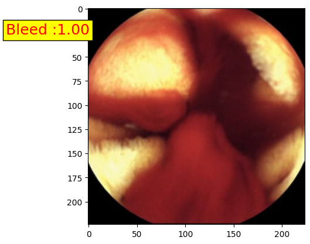

# Auto-WCEBleedGen-IIIT-Kalyani
|                | Accuracy | Recall | F1-Score | Precision  |
|Classification  | 0.996    | 1.000  | 0.996    | 0.992      |
| :---:          | :---:    | :---:  | :---:    | :---:      |

|                | Average Precision | Mean-Average Precision | Intersection over Union(IoU) |
|Detection       | 0.251             | 0.243                  | 0.201                        |
| :---:          | :---:             | :---:                  | :---:                        |

 

|||| Intersection over Union(IoU) |
|Detection       | 0.251             | 0.243                  | 0.201                        |
| :---:          | :---:             | :---:                  | :---:                        |
